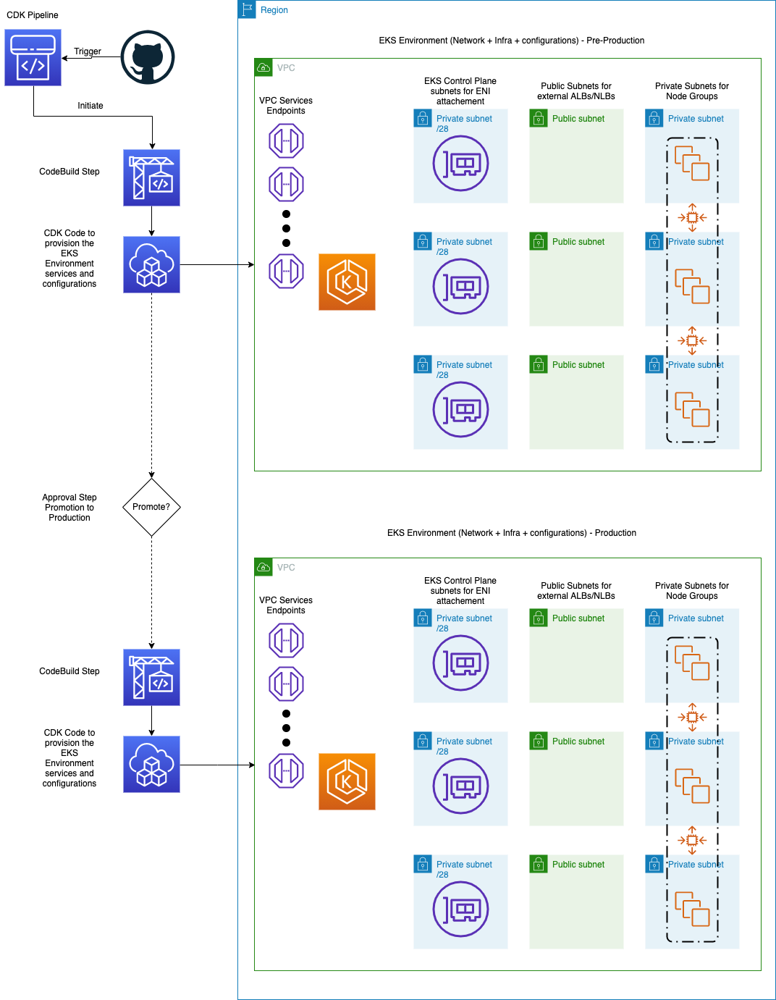
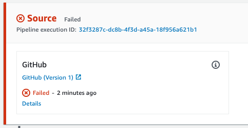
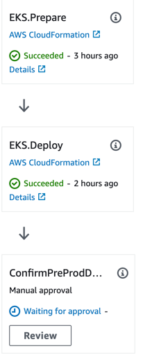
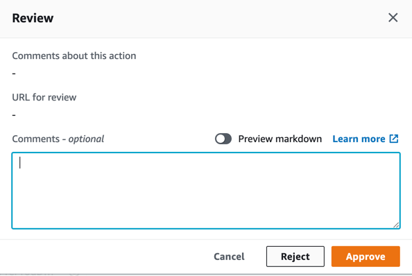

# Multi Environment EKS Cluster Management with AWS CDK

This project shows how AWS CDK can be used to provision and manage EKS cluster deployed in multiple environments. This
project uses cdk-pipelines construct to create pipeline between the different Amazon EKS clusters that deployed in
multiple environments.

This project follows
[EKS Best practices guide](https://aws.github.io/aws-eks-best-practices/cluster-autoscaling/index.html), and deploy
relevant add-ons like Cluster-Autoscaler, AWS Load Balancer Controller, and SSM Agent. It also
deploys [Weave Flux V2](https://www.weave.works/oss/flux/) for GitOps delivery. The reason that the Cluster add-ons are
deployed using CDK and not using Flux, is because these add-ons require configurations both on the AWS and on the
EKS/K8s (IAM roles and policies on AWS, and add-on deployment on K8s). All other application deployments will be
deployed using Weave Flux V2.

## Project Resources

This project follows the example of the
[CDK Pipeline blog](https://aws.amazon.com/blogs/developer/cdk-pipelines-continuous-delivery-for-aws-cdk-applications/)
and consist of a development environment that can be bootstrapped from a local machine for dev/testing purposes, and a
CDK Pipeline that creates 2 EKS Environments: pre-production and production.

The pre-production and the production environments will be deployed in the default region where the IAM user/role that
runs the project (in our example it was `eu-west-1`). This project also supports multi-region/account deployment, where
the production environment can be deployed in another region. For this, simply change the region in the `app.py` file
under the variable `production_env` to the region of your choice (`eu-central-1` for example). This pipeline is
constructed from multiple environments. Every EKS Environment have 2 layers:

- Network - this includes VPC configuration with the following configurations:
    1. VPC Endpoints for all services
    2. Public, Private, and dedicated Private subnet of /28 CIDR for the EKS Control plane
       (see the [docs](https://docs.aws.amazon.com/eks/latest/userguide/network_reqs.html))
- EKS Cluster
    1. Control Plane API-Server configured to be deployed on the dedicated private subnet
    2. Cluster endpoint access is configured to be Private only
    3. Nodegroup for OnDemand, Spot and Graviton instance types are being created
    4. Fargate-profile in the `default` namespace for pods labeled with `fargate: enabled` label
    5. Bastion host is deployed to manage access to the EKS cluster
    6. Flux Controller installed via User-Data script on the Bastion. This is because that at the time of writing this
       project, Flux V2 have to be bootstrapped using its own CLI.
    7. Cluster-Autoscaler is deployed with priority expander between Spot and OnDemand instances
    8. AWS Load Balancer Controller is deployed

This is a high-level diagram of the services and configurations that will be deployed in this project:


## Prerequisites for the entire project

- Since this project creates a CDK Pipeline for managing the lifecycle of the EKS environments, a GitHub account and
  repo is required. You'll need to configure parameter store and secrets in AWS System manager and AWS Secrets Manager
  as follows:
  - Parameter named `github-user` that stored as string, with the value of the user that owns the GitHub repository
      that will be used to manage the EKS Environments configuration. The parameter is being created in both `eu-west-1`
      region and `eu-central-1` since it's being used by the bastion server to bootstrap Flux V2 for GitOps. Use the
      following CLI command to create the SSM parameter (replacing <YOUR_GITHUB_USERNAME> with your actual GitHub
      user) :

      ```shell
      aws ssm put-parameter --name "github-user" \
      --region eu-west-1 \
      --value "<YOUR_GITHUB_USERNAME>" \
      --type "String"
      aws ssm put-parameter --name "github-user" \
      --region eu-central-1 \
      --value "<YOUR_GITHUB_USERNAME>" \
      --type "String"
      ```

  - Secret named `github-token` that stored as plaintext the value of a GitHub token for the `github-user` above. Same
      as the above, either using the AWS Secrets Manager console, or using the following CLI command:

      ```shell
      aws secretsmanager create-secret --name github-token \
      --add-replica-regions "Region=eu-central-1" \
      --description "GitHub token" \
      --secret-string <YOUR_GITHUB_TOKEN>
      ```

- CDK Installed -
  see [Getting Started With the AWS CDK](https://docs.aws.amazon.com/cdk/latest/guide/getting_started.html)
- Python3.7 installed
- Fork the [flux-eks-gitops-config](https://github.com/aws-samples/flux-eks-gitops-config) repository from aws-samples. This repository holds flux configuration for the cluster add-ons and applications

### Clone the code

```bash
git clone https://github.com/aws-samples/eks-multi-environment-cdk-pipeline --depth=1 --branch=main eks-multi-environment-cdk-pipeline && rm -rf ./eks-multi-environment-cdk-pipeline/.git
cd eks-multi-environment-cdk-pipeline
```

### Create Python virtual environment and install the dependencies

```bash
python3 -m venv .venv
source .venv/bin/activate
# [Optional] Needed to upgrade dependencies and cleanup unused packages
pip install pip-tools==6.2.0
pip-compile --upgrade  -o requirements-dev.txt requirements-dev.in
pip-compile --upgrade  -o requirements.txt requirements.in
./scripts/install-deps.sh
./scripts/run-tests.sh
```

> At this time, we are not using the latest version of cdk but the `1.119.0`

### Bootstrap CDK In the Target Region/s

CDK needs to be bootstrapped in every region we want to run on. When creating our development environment we want to
make sure it has been bootstrapped in the 2 regions we are targeting (note: we only needs to do this once per region):

```bash
AWS_ACCOUNT=$(aws sts get-caller-identity --query "Account" --output text)
AWS_REGION=$(aws configure get region --output text)
npx cdk bootstrap \
  --cloudformation-execution-policies arn:aws:iam::aws:policy/AdministratorAccess \
  aws://$AWS_ACCOUNT/$AWS_REGION
```

In case you are looking to deploy the production environment to a different region, you'll need to bootstrap CDK in the
other region as well

```bash
AWS_ACCOUNT=$(aws sts get-caller-identity --query "Account" --output text)
AWS_REGION=<FILL_IN_YOUR_DESIRED_PRODUCTION_REGION>
npx cdk bootstrap \
  --cloudformation-execution-policies arn:aws:iam::aws:policy/AdministratorAccess \
  aws://$AWS_ACCOUNT/$AWS_REGION  
```

## Deploy the EKS Development Environment

**Deployment**

The `EKSEnvDev` stage uses your default account and region. It consists of two stacks - Network and EKS (both defined
in `deployment.py`)

```bash
npx cdk deploy "EKSEnvDev/*"
```

Example outputs for `npx cdk deploy "EKSEnvDev/*"`:

```text
 ✅  EKSEnvDevEKS<ID> (EKSEnvDev-EKS)

Outputs:
EKSEnvDevEKS<ID>.EKSMultiEnvClusterEKSclusterConfigCommand<ID> = aws eks update-kubeconfig --name EKSMultiEnv-Dev --region eu-west-1 --role-arn arn:aws:iam::123456789101:role/EKSEnvDev-EKS-EKSMultiEnvClusterEKSClusterAdminRol-<ID>
EKSEnvDevEKS<ID>.EKSMultiEnvClusterEKSclusterGetTokenCommand<ID> = aws eks get-token --cluster-name EKSMultiEnv-Dev --region eu-west-1 --role-arn arn:aws:iam::123456789101:role/EKSEnvDev-EKS-EKSMultiEnvClusterEKSClusterAdminRol-<ID>

Stack ARN:
arn:aws:cloudformation:eu-west-1:123456789101:stack/EKSEnvDev-EKS/<ID>
```

After the cluster had been created, it is manageable (for human interaction) through the bastion instance. If you want
to interact with the cluster, you can simply connect to the bastion through SSM connect (from the EC2 console), and
interact with the EKS cluster with `kubectl` commands

## Deploy EKS Environment to Multiple Environments using CDK Pipelines

**Prerequisites**

- Follow the prerequisites in [Deploy the EKS Development Environment](#deploy-the-eks-development-environment)
- Make sure you are in the directory of this cloned repo (`cd eks-multi-environment-cdk-pipeline`)
- Create git your own GitHub repository that will contain this project as source for CDK Pipeline
  - You can do it either by using [hub cli](https://github.com/github/hub) for GitHub and run the following command
      from the cloned repo directory (replace <YOUR_GH_USERNAME> with your own username)

      ```bash
      GITHUB_USERNAME=<YOUR_GH_USERNAME>
      git init
      hub create -p $GITHUB_USERNAME/eks-multi-environment-cdk-pipeline
      ```

  - Using GitHub console to [create a repository](https://docs.github.com/en/get-started/quickstart/create-a-repo) and
      add it as a remote to the cloned repo folder

In this step, we'll deploy the pipeline that manages our EKS across multiple environments using the Pipeline stack that
will create the AWS CodePipeline pipeline needed to manage our EKS clusters across multiple environments.

```bash
npx cdk deploy EKSMultiEnv
```

The output should look like this:

```shell
 ✅  EKSMultiEnv

Stack ARN:
arn:aws:cloudformation:eu-west-1:123456789012:stack/EKSMultiEnv/<ID>
```

After the pipeline is deployed, an AWS CodePipeline pipeline had been created, but it shows in status failed. The reason
for this is that you haven't committed any change to the repo you've just created, and therefore CodePipeline fails to
get GitHub repository data.



What you'll need to do now is to add, commit, and push the files from the cloned repo to the repo you've just created

**Improtant**
---

Please remove the line containing `cdk.context.json` from the [`.gitignore`](./.gitignore) file in this folder, in order to track it on your created repository. The reason for this is because this file is part of your app's state and is critical to being able to synthesize and deploy consistently. For more information, please refer to the AWS CDK [docs](https://docs.aws.amazon.com/cdk/v2/guide/context.html#context_construct)
---

This way the code pipeline will get all the relevant configurations from the git repository, and will apply them to the
environments configured in the pipeline. Every future change that will be committed/merged to the `main` branch of the
`eks-multi-environment-cdk-pipeline` repo that had been created in the previous steps, will automatically trigger an AWS
CodePipeline pipeline. This will apply changes across the environments configured in the pipeline itself. Therefore, you
need to commit&push the content of this folder to the remote repository. You can do this by running these commands:

```bash
git add .
git commit -am "Initial commit"
git branch -m master main
git push origin main
```

After pushing the content, the pipeline should start executing, and the EKS environments should start been deployed. As
a precaution measurement, before continuing to the production environment, there's a manual approval needed for the
pre-production EKS environment. After the pre-production EKS environment had been created,you can approve or deny the
changes, and this will affect whether the production changes will be deployed as well. As for the first run (building
the environment), let's approve the change and let the pipeline create the production EKS environment.




## Introduce a change to the EKS Environment configuration

Let's say we'd want to change something in the cluster configuration. What we need to do, is to implement the change in
one of the CDK constructs that assemble our environment. We can modify the `eks.py` file in the eks package, and simply
commit and push the changes to the `eks-multi-environment-cdk-pipeline` repo. This will trigger the AWS CodePipeline
that was created using the CDK Pipeline construct, and will start deploying the changes, starting with the pre-prod
environment. In case you wouldn't want this change to be deployed to the prod environment, you'll be able to reject the
transition of the pipeline for production deployment. This way you'll be able to re-test or re-design your change.

For demonstrations purposes, let's say we want to upgrade the Cluster-Autoscaler helm chart version to a higher version
[Chart version 9.10.3](https://github.com/kubernetes/autoscaler/releases/tag/cluster-autoscaler-chart-9.10.3). For this,
we'll change the code in `eks.py` file in method `_deploy_cluster_autoscaler`, and simply change the version from 9.9.2
to 9.10.3 in the `cluster_autoscaler_chart` object. After that, commit and push the change to
the `eks-multi-environment-cdk-pipeline` repository:

```bash
git add eks/eks.py
git commit -am "bump CA helm version to 9.10.3"
git push origin main
```

Now if you'll navigate to the AWS CodePipeline console, you'll notice that the pipeline had been triggered by the latest
commit to the `eks-multi-environment-cdk-pipeline` repository. AWS CodePipeline using the modified CDK code, to
understand what changes need to be implemented and perform this to every step in the pipeline. When the pipeline will
reach the approval step, we can then reject the approval and NOT implement the change to the production cluster

## Delete all stacks

**Do not forget to delete the stacks to avoid unexpected charges**

```bash
npx cdk destroy EKSMultiEnv

npx cdk destroy EKSMultiEnv/EKSMultiEnv-Production/*

npx cdk destroy EKSMultiEnv/EKSMultiEnv-PreProduction/*

npx cdk destroy EKSEnvDev/*
```

## Security

See [CONTRIBUTING](CONTRIBUTING.md#security-issue-notifications) for more information.

## License

This library is licensed under the MIT-0 License. See the LICENSE file.
